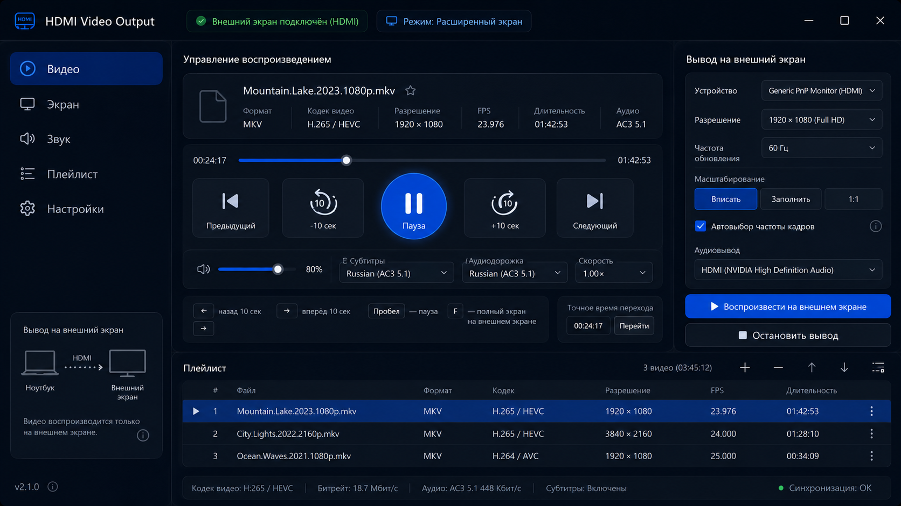

# ScreenPilot

ScreenPilot — личное Windows-приложение для воспроизведения локальных видеофайлов на одном выбранном внешнем экране. Управление остаётся на ноутбуке; предпросмотра и второго видеопотока на встроенном дисплее нет.

Версия: **0.1.0**. Целевая система — Windows 10/11 x64. Приложение не меняет системное устройство звука по умолчанию и не включает HDR Windows.



## Что умеет

- выводит видео через отдельный полноэкранный процесс mpv только на выбранный внешний экран;
- распознаёт HDMI и другие внешние экраны, которые Windows предоставляет через Display Configuration API;
- при необходимости временно включает расширенный рабочий стол и меняет только режим выбранного внешнего экрана, затем восстанавливает исходную конфигурацию;
- воспроизводит плейлист, предотвращает дубликаты, поддерживает drag-and-drop, порядок, переходы между файлами и автоматический переход к следующему;
- сохраняет последнюю папку и позицию просмотра, предлагает продолжить просмотр или начать заново;
- поддерживает внешние `.srt`, `.ass`, `.ssa`, выбор дорожек и аудиовыхода mpv;
- даёт паузу, остановку видео без закрытия вывода, перемотку, громкость, масштабирование и локальные горячие клавиши;
- хранит логи в `%LOCALAPPDATA%\ScreenPilot\logs\screenpilot.log`, не допускает второй экземпляр и копирует обезличенную диагностику в буфер обмена.

## Быстрый старт

Для запуска из исходников нужны Windows, JDK 21 и локальный runtime mpv из [vendor/mpv/README.md](vendor/mpv/README.md). Runtime специально не хранится в Git и приложение никогда не скачивает его само.

```powershell
.\gradlew.bat clean test integrationTest
.\gradlew.bat :screenpilot-app:run
```

Подключите внешний экран, в Windows включите «Расширить эти экраны», выберите файл и экран в ScreenPilot, подтвердите подготовку, затем нажмите «Воспроизвести на внешнем экране».

Горячие клавиши действуют только в окне приложения: `Space` — пауза, `←`/`→` — ±10 секунд, `Ctrl+←`/`Ctrl+→` — ±60 секунд, `↑`/`↓` — громкость, `Esc` — остановить вывод, `Ctrl+O` — открыть файлы.

## Установщик

Сборка проверяет SHA-256 каждого файла локального mpv runtime, создаёт self-contained app image и per-user EXE: Java отдельно пользователю не нужна, права администратора не требуются.

```powershell
.\gradlew.bat :screenpilot-app:packageInstaller
```

Готовый файл появляется в `screenpilot-app\build\jpackage\installer\ScreenPilot-0.1.0.exe`. Для быстрой проверки без установки используется `:screenpilot-app:packageAppImage`.

EXE и mpv binary намеренно не публикуются в Git-репозитории. Перед публичной раздачей самого установщика необходимо закрыть лицензионную проверку точной сборки mpv и её зависимостей; текущая личная сборка и исходный код содержат [зафиксированные хэши и notices](vendor/mpv/README.md).

## Проверка качества

Автоматическая проверка:

```powershell
.\gradlew.bat --no-daemon clean test integrationTest
.\gradlew.bat --no-daemon :screenpilot-app:packageInstaller
```

`packageInstaller` требует WiX Toolset 3.x, который `jpackage` обнаруживает автоматически. Аппаратные результаты и оставшиеся проверки находятся в [чек-листе](docs/hardware-test-checklist.md), выпускной статус — в [release checklist](docs/release-checklist.md).

## Устройство проекта

- `screenpilot-domain` — модели, правила и state machines без JavaFX, JNA, mpv и файловой системы;
- `screenpilot-player-mpv` — дочерний процесс mpv и JSON IPC по локальному Windows named pipe;
- `screenpilot-platform-windows` — Win32/JNA: экраны, временные режимы, recovery и Job Object;
- `screenpilot-persistence` — JSON settings, resume и recovery journal;
- `screenpilot-app` — JavaFX-интерфейс, единое состояние, упаковка и lifecycle приложения.

Существенные решения зафиксированы в [ADR](docs/adr/README.md). Полное техническое задание — [ScreenPilot_TZ.md](ScreenPilot_TZ.md), исходные требования — [ScreenPilot_FT.md](ScreenPilot_FT.md).

## Ограничения версии 0.1.0

- Воспроизведение на реальном телевизоре и физический HDMI-аудиовывод ещё не проверены.
- Нет автоматического обновления, телеметрии, сети, preview на ноутбуке, HDR passthrough и одновременного вывода на несколько экранов.
- Исходный код опубликован для прозрачности личного проекта. Лицензия на повторное использование ScreenPilot пока не предоставляется; для этого потребуется отдельное решение автора.
